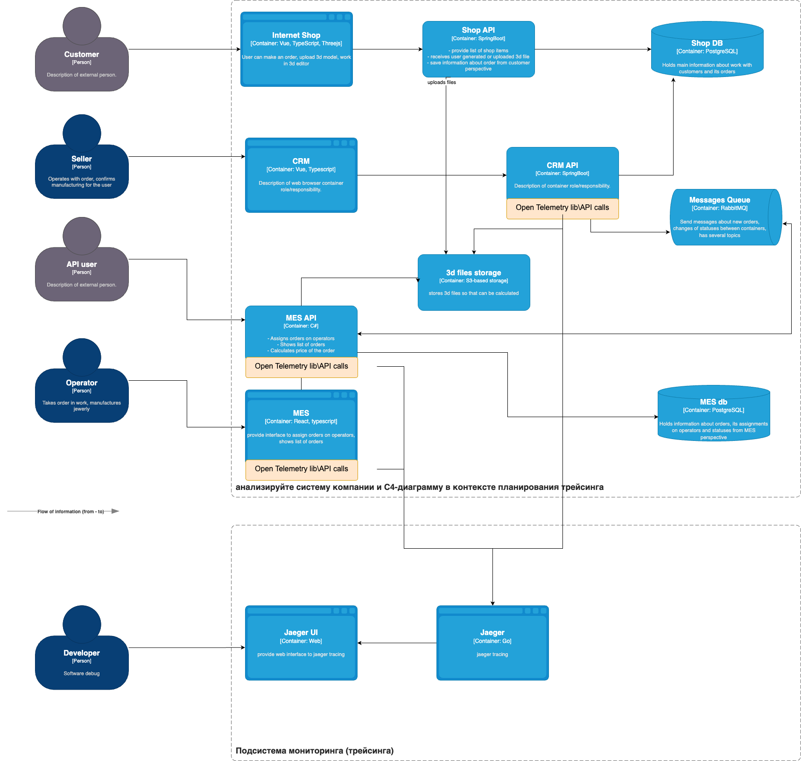

# Анализ систему компании и C4-диаграмму в контексте планирования трейсинга

Основные жалобы пользователей сосредоточены вокруг API MES, это и со стороны frontend MES, и со стороны обработки запросов из очереди от CRM, следовательно в трейсинг нужно добавлять связанные с API MES подсистемы. Заказ может сломаться на этапе обработки в MES, на этапе отправки данных в очередь, на этапе формирования запроса к API MES.
Данные для трейсинга должны в себя включать контекст операции: статическая информация о ноде \ инстансе приложения и динамическую информацию о текущей операции (span_id, trace_id).

# Мотивация

Трейсинг - важный аспект Observability решения, для бизнеса это поможет:
1. Быстрее разбираться с проблемами клиентов.
2. Повысить надежность текущего решения, тк будет больше информации для разбора проблем.
3. Определить уровень сложности различных операций, соответственно, это информация для расстановки приоритетов.

Для команды разработки трейсинг поможет:
1. Проводить полноценную отладку распределенных систем.
2. Лучше понимать взаимосвязь запросов и данных, которые передаются между подсистемами.
3. Повысить качество фиксов проблем пользователей, учитывать необходимые аспекты.

# Предлагаемое решение

Трейсинг на основе OpenTelemetry и Jaeger:

1. Для компонент, которые мы хотим добавить в трейсинг, необходимо слинковать библиотеку opentelemetry
2. Для каждого модуля включить телеметрию (trace.set_tracer_provider)
3. В каждый отслеживаемый метод нужно добавить span
4. В каждое приложение нужно добавить opentelemetry-exporter-jaeger, для отправки трейсов в jeager
5. Установить Jaeger вместе с UI
6. Убедиться, что для exporter-ов есть сетевая доступность с Jaeger
7. Настроить для себя UI

# Компромиссы

1. Трассировка потребуется времени разработки, для сложных участков кода (например, в приобретенной MES) со множеством вызовов добавление трейсинга - это очень трудоемкая процедура.
2. Трассировка замедляет выполнение кода, для критичных к производительности участков ее лучше отключать. 
3. Трассировка может генерить огромное количество данных, для прода трассировать все вызовы - невероятно дорого и избыточно, все трассы никто не будет смотреть. Имеет смысл трассировать рандомные несколько процентов вызовов, для отладки этого достаточно, хотя мы можем пропусить проблеммные запросы.

# Аспекты безопасности

Одна из проблем трассировки, что пользователям Jaeger будет доступна бизнес-информация пользователей из параметров запроса и контекста операции, в том числе - финансовая и личная информация. Чтобы избежать рисков неправомерного использования, предлагаю:

1. Предоставлять доступ к отладчику только для доверенных сотрудников.
2. Хешировать \ маскирвать личную информацию, чтобы ее сложно было достать из трассы. Разумеется, если это не окажет влияние на логику отладки.
3. Особо приватную информацию, например, стоимости не добавлять в трассы совсем.