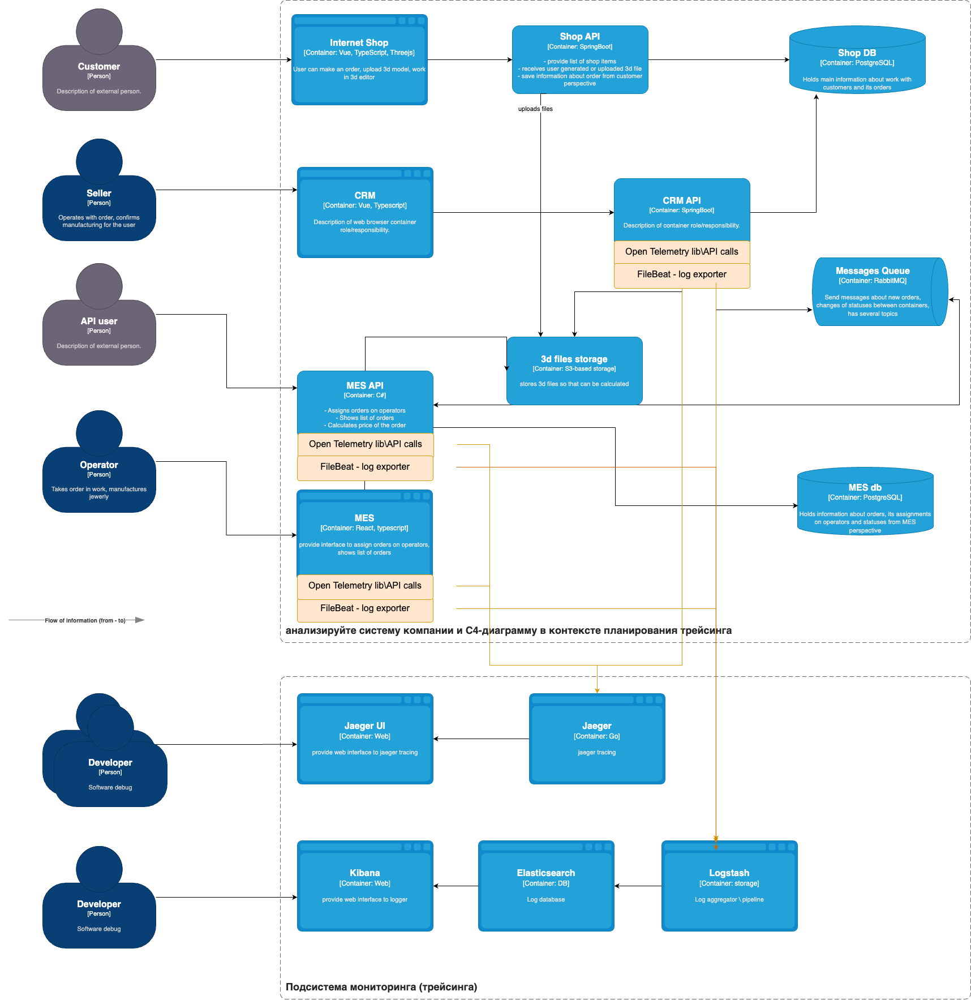

# Анализ системы компании и C4-диаграммы в контексте планирования логирования. 

Сбор логов следует поделить на серверные приложения - Shop API, CRM API, MES API и клиентские приложения - Shop, CRM, MES. С клиента собирать логи сложнее и дороже, при этом менее важно, тк наиболее сложная логика должна быть на backend. С клиента обычно собирают логи об ошибках, с помощью Sentry, c сервера уже можно более подробно логировать клиентские запросы, изменение статусов заказов, предупреждения и ошибки.

Примерный список логов уровня INFO:

1. Поступил входящий запрос, логируем время, URL, параметры, которые важны для отладки.
2. Изменение статуса заказа, логируем время, метод изменения, номер заказа, id пользователя.
3. Отправка сообщения в очередь, логируем время, номер заказа, параметры.
4. Загрузка файла от пользователя, логируем время, путь к файлу, метаданные файла, id пользователя.
5. Начат и окончен расчет заказа в MES, логируем время начала и окончания операции, номер заказа, вспомогательные параметры.

Помимо уровня INFO важно фиксировать другие уровни логов:

1. FATAL - критичные, как правило, системные ошибки
2. ERROR - при возникновении любой программной ошибки, логируем время, код ошибки, операцию, параметры (если возможно).
3. WARNING — на усмотрение разработчика могут быть добавлены подозрительные события, например, превышение допустимого времени обработки запроса \ операции, повышение уровня потребления системных ресурсов, но пока не критично.

Логи INFO описаны выше, логи DEBUG и TRACE логично использовать на этапе разработки, в продакшн их лучше исключать, чтобы не потреблять ресурсы логгера. К тому же мы внедряем трейсинг, данные логи могут быть избыточны.

# Мотивация

Логирование - важнейший элемент Observability. Логи добавляют одним из первых, тк это уже на этапе разработки помогает программисту отладить различные кейсы. Более подробно, рассмотрим преимущества логирования для бизнеса и разработки:

С точки зрения бизнеса:
1. Повышается понимание, что происходило с системой, это поможет с разбором различных ситуаций и принятию бизнес решений по развитию и поддержке портала.
2. Логи могут содержать аналитическую информацию, которая вновь делает систему более прозрачной и поможем принимать управленческие решения.
3. Логи упрощают и ускоряют решение проблем пользователей.

С точки зрения разработки:
1. Логи помогают в отладке системы на всех этапах разработки и эксплуатации ПО. При этом это самый простой и выразительный инструмент.
2. Логи позволяют сопроводить отладку дополнительной информацией, которая недоступна в трейсах.
3. Логи позволяют проводить аналитику по количеству и динамике возникновения различных ситуаций.
4. Логи позволяют отлаживать производительность участков кода.

Логирование имеет смысл реализовать для более простых подсистем, например, обработчиков клиентских запросов, которые не делают сложные вызовы в другие модули. Трассировку же, напротив, имеет смысл доабвлять именно в сложные распределенные вызовы, где важно сопоставить, из какого контекста пришел тот или иной запрос.

# Предлагаемое решение»

Логирование на основе стека ELK выглядит следующим образом:

1. К каждому приложению, откуда мы планируем собирать логи нужно установить агент для сбора логов - FileBeat, в конфигурации следует указать, из каких файлов мы будем собирать логи для последующей отправки в Logstash.
2. Установить Logstash для сбора логов из каждого приложения, указать формат логов, которые мы будем слушать. В конфиге каждого FileBeat указать путь к Logstash.
3. Установить Elasticsearch как базу данных для индексации и запросов к логам.
4. Установить Kibana как веб-интерфейс для визаулизации, указать хост Elasticsearch для доступа.
5. В настройках Elasticsearch\Kibana нужно указать шаблон логов для парсинга и индексации поступающих через Logstash логов.

## Политика безопасности в отношении логов  

Логи могут содержать персональные или иные чувствительные данные компании, поэтому в целях безопасности важно:

1. Предоставлять доступ ELK только авторизованным сотрудникам разработки и поддержки.
2. Не добавлять \ маскировать персональные данные пользователей в логах.
3. Ротировать логи в исходных файлах, чтобы там они долго не хранились и не были доступны для несанкционированного доступа.

## Политика хранения в отношении логов

Для старта приложение не выглядит чрезмерно нагруженным, думаю, одного инстанса для индекса хватит на долгое время. Тем не менее, можно заранее предусмотреть следующие политики в отношении логов:

1. При выявлении изолированного бизнес функционала создать отдельный индекс, для старта лучше и проще использовать один.
2. Для текущего индекса настроить условия ролловера при увеличении размера индекса, от бизнеса нужно получить максимальное время хранения оперативных данных, например, 6 месяцев.
3. При исчерпании дискового хранилища устаревшие индексы имеет смысл переместить в холодное хранилище, например, s3. Совсем старые данные - удалять.

# Необходимые мероприятия для превращения системы сбора логов в систему анализа логов

1. Важные для бизнеса данные, которые не попали в мониторинг можно включить в дашборды Kibana. Это могут быть аггрегации, инструменты машинного обучения и тд. Есть ряд [статей](https://opster.com/guides/elasticsearch/operations/elasticsearch-analytics-techniques/), которые показывают возможности для бизнес анализа.
2. В Kibana есть функционал [алертинга](https://www.elastic.co/kibana/alerting), таким образом можно настроить дополнительные оповещения о ситуациях, которые оказались не покрыты мониторингом из задания 2. Например, это могут быть логи уровня Warning.
 