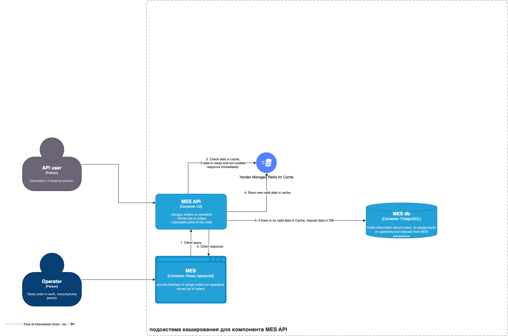

# Анализ диаграммы системы и её описание

Кеширование (наряду с именованием переменных) - довольно сложная тема для правильного внедрения, имеет смысл ее использовать максимально обоснованно. Поэтому я бы предложил начать в решения конкретной проблемы операторов MES - долгой загрузки заказов. Если для каждой загрузки страницы делается сложный запрос в базу, извлекается и фильтруется большой объем данных, хотя данные меняются не так часто, то MES API - первый кандидат на добавление серверного кеша.

Далее, имеет смысл рассмотреть веб-приложения, есть ли там справочные и любые другие редко изменяющиеся данные (исключая статику, скрипты самого сайта). Для таких случаев следует использовать клиентское кеширование.

# Мотивация

Кеширование позволяет кардинально повысить устойчивость и отзывчивость системы, поскольку уменьшает потребление системных ресурсов для запросов, которые не изменяются от респонса к респонсу.

# Предлагаемое решение

Для реализации предлагаются паттерны Cache-Aside и Write-Trough, тк для формирования списков и обновления данных возможны разные кейсы

1. При формировании списков есть возможность хранить любую удобную для клиента структуру ответа (Cache-Aside).
2. Устойчивость к сбоям подсистемы кеширования. При любых проблемах Managed Cache мы продолжим работать с базулей (Cache-Aside).
3. Для запросов на обновление данных мы можем сразу обновлять данные в кеше по ключу, чтобы сократить количество неконсистентных ответов.
4. Полагаю, что cache miss при первом обращении не так критичен, поскольку мало пользователей будут ожидать данные. 
5. С точки зрения бизнеса даже возможно отдавать на клиент заведомо устаревшие данные, зато страница будет открываться быстро. Разумеется, надо четко согласовать с бизнесом, в каком случае это возможно.

Хотя в данном варианте возможна временная несогласованность между данными в БД и кешем, не считаю, что это критично, поскольку заказы в MES появляются относительно редко, не страшно, если в 1% случаев кто-то из операторов может не получить крайний заказ. Вероятность выдачи устаревшего списка можно сократить, если установить низкую TTL для данных в кеше.

## Диаграмма последовательностей

Последовательность действий уже отражена на схеме выше, кратко:

1. Клиент отправляет запрос за данными, например, списком заказов.
2. Сервер проверяет данные в кеше, если данные есть и время жизни еще не истекло (хотя Redis может сам удалять ключи при исчерпании TTL), отдаем данные сразу клиенту, не делаем запрос на сервер.
3. Если данных в кеше нет, делаем запрос на сервер.
4. Формируем структуру ответа для клиента с данными от сервера, кладем эту структуру с необходимым TTL в кеш.
5. Отправляем ответ клиенту.

# Стратегии инвалидации кеша

Предлагается использовать комбинированный подход, ниже прокомментрию свой выбор:

1. **Временная инвалидация**. Устанавливаем время жизни данных в кеше. Используем в любом случае, поскольку это самый просто способ контроля актуальности данных, плюс дополнительная гарантия, если мы забудем\ошибемся где-то в программной инвалидации.
2. **Программная инвалидация**. В коде приложения явно прописывается сброс кеша при изменении каких-либо данных или других условий. Это наиболее гибкий, хотя и трудоемкий способ. Используем.

Остальные способы считаю менее подходящими для кеширования списка заказов.

3. _Инвалидация, основанная на запросах_. Сброс кеша происходит на любой запрос изменения данных. Это менее гибко, чем программная инвалидация, мы рискуем сбрасывать кеш слишком часто.
4. _Инвалидация на основе изменений_. Сброс кеша происходит при каждом изменении данных. Тоже есть риски, что мы будем сбрасывать кеш слишком часто.
5. _Инвалидация по ключу_. Позволяет инвалидировать только часть данных в кеше. Это было бы полезно, если бы мы хотели обновить, например, статусы конкретных заказов. Считаю этот способ тоже подходящим, как и программная инвалидация, но более трудоемким для разработчика. Тк возникают риски неконсистентности, проще для старта использовать программную инвалидацию.